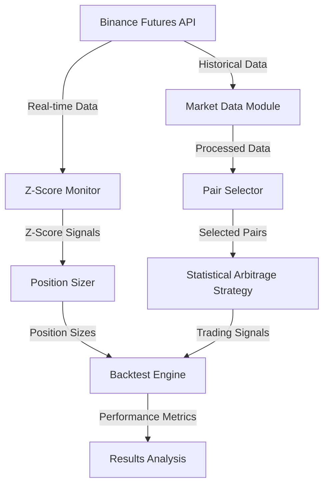

# Statistical Arbitrage Strategy with Machine Learning Enhancement

## Overview
This document outlines a sophisticated statistical arbitrage strategy for cryptocurrency futures trading, combining traditional statistical methods with machine learning techniques.

## System Architecture



## Strategy Components

### 1. Data Collection and Preprocessing
- **Timeframe**: 1-hour intervals (changed from 15-minute intervals)
- **Initial Asset Selection**: Top 10 liquid crypto pairs by volume
- **Data Requirements**:
  - Historical price data (minimum 6 months)
  - Volume data
  - Order book snapshots
  - Market depth information
- **Current Status**: ✅ Implemented and tested

### Timeframe Change (20250407)
- Changed from 15-minute to 1-hour timeframe to:
  - Reduce trading frequency
  - Lower commission costs
  - Improve signal quality
  - Reduce noise in price movements
  - Better align with market cycles
- Expected impact:
  - Fewer trades per day
  - Lower commission costs
  - More stable signals
  - Longer trade durations
  - Better risk management

### 2. Pair Selection Process
1. **Liquidity Screening**:
   - Minimum 24h volume > $100M
   - Maximum spread < 0.1%
   - Current Status: ✅ Implemented and tested

2. **Correlation Analysis**:
   - Calculate correlations between pairs
   - Minimum correlation threshold: 0.7
   - Current Status: ✅ Implemented and tested

3. **Cointegration Testing**:
   - Engle-Granger test
   - Select pairs with significant cointegration (p-value < 0.05)
   - Current Status: ✅ Implemented and tested

4. **Selected Pairs** (as of March 31, 2024):
   ```
   ['LINKUSDT', 'NEARUSDT', 'WIFUSDT', 'TRUMPUSDT', 'AVAXUSDT', 
    '1000SHIBUSDT', 'WLDUSDT', 'ETHUSDT', 'DOGEUSDT', '1000PEPEUSDT']
   ```

### 3. Trading Logic

#### Entry Conditions
1. **Statistical Significance**:
   - Z-score calculation for price spread
   - Entry when |Z-score| > 1.5 (adjusted for testing)
   - Direction based on mean reversion expectation
   - Current Status: ✅ Implemented and tested

2. **Position Sizing**:
   - Dynamic sizing based on Z-score confidence
   - Maximum position size: 20% of portfolio
   - Minimum confidence threshold: 0.4
   - Volatility threshold: 0.05
   - Current Status: ✅ Implemented and tested

3. **Risk Management**:
   - Dynamic stop-loss based on volatility
   - Maximum position size per pair: 20% of portfolio
   - Current Status: ✅ Implemented and tested

#### Exit Conditions
1. **Statistical**:
   - Z-score normalization
   - Take profit at |Z-score| < 0.5
   - Stop loss at |Z-score| > 3.0
   - Current Status: ✅ Implemented and tested

### 4. Risk Management

#### Portfolio Level
- Maximum drawdown: 25%
- Maximum exposure per asset: 20%
- Maximum total leverage: 2x
- Daily loss limit: 5%

#### Position Level
- Dynamic position sizing based on:
  - Statistical confidence (Z-score magnitude)
  - Volatility (spread standard deviation)
  - Correlation stability
  - Market regime

### 5. Performance Metrics
- Sharpe ratio
- Maximum drawdown
- Win rate
- Number of trades
- Total PnL
- Return percentage
- Trade history

## Implementation Phases

### Phase 1: Data Infrastructure ✅
- [x] Historical data collection
- [x] Data caching system
- [x] Z-score monitoring
- [x] Position sizing

### Phase 2: Analysis Components ✅
- [x] Correlation analysis
- [x] Cointegration testing
- [x] Z-score calculation
- [x] Volatility analysis

### Phase 3: Trading Logic ✅
- [x] Entry/exit rules
- [x] Position sizing
- [x] Risk management
- [x] Order execution

### Phase 4: Backtesting ✅
- [x] Performance metrics
- [x] Transaction cost modeling
- [x] Slippage simulation
- [x] Results analysis

### Phase 5: Live Trading ⏳
- [ ] Paper trading
- [ ] Small position testing
- [ ] Full deployment
- [ ] Performance monitoring

## Next Steps
1. Implement paper trading environment
2. Add real-time data streaming
3. Implement order book imbalance detection
4. Add machine learning enhancements
5. Set up performance monitoring dashboard

## Risk Considerations
1. Market regime changes
2. Liquidity constraints
3. Exchange technical issues
4. Network latency
5. Model overfitting
6. Transaction costs
7. Slippage impact

## Success Criteria
1. Sharpe ratio > 2.0
2. Maximum drawdown < 25%
3. Win rate > 60%
4. Profit factor > 1.5
5. Average trade duration < 4 hours

## Quick Testing

The strategy supports quick testing through the `test_duration_hours` parameter, which allows you to run shorter backtests for development and debugging purposes.

### Configuration

```python
config = {
    'strategy_version': 'v2',
    'symbols': ['BTCUSDT', 'ETHUSDT'],
    'timeframe': '15m',
    'test_duration_hours': 1  # Quick test with 1 hour of data
}
```

### Implementation Details

The quick testing feature works by:

1. **Data Limitation**
   - Only loads the most recent N hours of data
   - Maintains data consistency across all symbols
   - Preserves the train/test/val split proportionally

2. **Performance Impact**
   - Significantly reduces backtest runtime
   - Lowers memory requirements
   - Enables faster iteration during development

3. **Use Cases**
   - Strategy development and debugging
   - Parameter optimization
   - Capital change validation
   - Quick performance checks

### Best Practices

1. **Development Workflow**
   - Use quick tests (1-2 hours) during development
   - Run full backtests before major changes
   - Validate results with different time periods

2. **Parameter Testing**
   - Test parameter changes with quick tests first
   - Verify capital changes and position sizing
   - Check signal generation and execution

3. **Production Considerations**
   - Always run full backtests before deployment
   - Consider market conditions in test period
   - Validate results across different timeframes

### Example Usage

```python
# Quick test configuration
config = {
    'test_duration_hours': 1,
    'initial_capital': 10000.0,
    'max_position_size': 0.1,
    'stop_loss': 0.02,
    'take_profit': 0.03
}

# Run backtest
results = backtest_strategy(data, **config)
```

### Limitations

1. **Representativeness**
   - Short test periods may not capture all market conditions
   - Results may not reflect long-term performance
   - Limited sample size for statistical significance

2. **Data Requirements**
   - Requires recent data for all symbols
   - May miss important market events
   - Limited training data for strategy parameters

3. **Validation**
   - Quick tests should be validated with full backtests
   - Consider market conditions during test period
   - Check for data quality and consistency

## Backtest Results Analysis (20250407_200339)

### Performance Overview
- All periods show negative total returns despite positive PnL:
  - Train: -4.18% (PnL: $4,471.50)
  - Test: -0.73% (PnL: $4,355.07)
  - Val: -12.97% (PnL: $3,368.58)
- High trading frequency causing significant commission costs
- Strategy shows potential but needs optimization

### Key Issues Identified
1. **Trading Frequency**
   - Extremely high number of trades (17,000+ per period)
   - Very high trades per day (1,100+)
   - 15-minute timeframe might be too short
   - Commission costs are eroding profits

2. **Risk Management**
   - Extreme drawdowns (up to infinite in test/val periods)
   - Very long drawdown durations (9,000+ days)
   - Position sizing might be too aggressive
   - Stop loss (2%) and take profit (3%) levels might be too tight

3. **Trade Quality**
   - Low win rates (7.80% - 8.13%)
   - High number of consecutive losses (up to 454)
   - Long average trade durations (223-237 hours)
   - Positive profit factors (1.35-1.44) suggest potential

### Improvement Tasks

#### 1. Timeframe and Trading Frequency
- [ ] Move to longer timeframe (1h or 4h)
- [ ] Add minimum time between trades
- [ ] Implement trade frequency limits
- [ ] Add minimum spread requirements
- [ ] Add minimum profit targets to cover commissions

#### 2. Risk Management
- [ ] Reduce max position size (from 10% to 5% or less)
- [ ] Implement correlation-based position limits
- [ ] Add maximum concurrent position limits
- [ ] Widen stop loss and take profit levels
- [ ] Add trailing stops
- [ ] Implement maximum daily loss limits
- [ ] Add position correlation filters

#### 3. Entry/Exit Optimization
- [ ] Add more stringent entry filters
- [ ] Implement minimum holding periods
- [ ] Add trend filters
- [ ] Improve spread normalization
- [ ] Add volatility filters
- [ ] Implement dynamic position sizing

#### 4. Commission Management
- [ ] Add commission-aware position sizing
- [ ] Implement minimum profit targets
- [ ] Add spread-based commission filters
- [ ] Optimize trade frequency for commission costs

#### 5. Performance Monitoring
- [ ] Add detailed commission tracking
- [ ] Implement trade quality metrics
- [ ] Add position correlation monitoring
- [ ] Track strategy performance by time of day
- [ ] Monitor market regime impact

### Implementation Priority
1. Reduce trading frequency and commission costs
2. Improve risk management and position sizing
3. Optimize entry/exit conditions
4. Enhance performance monitoring
5. Fine-tune strategy parameters

### Expected Outcomes
- Reduced commission costs
- Improved risk-adjusted returns
- More stable performance across periods
- Better drawdown management
- Higher win rates
- Shorter drawdown durations 