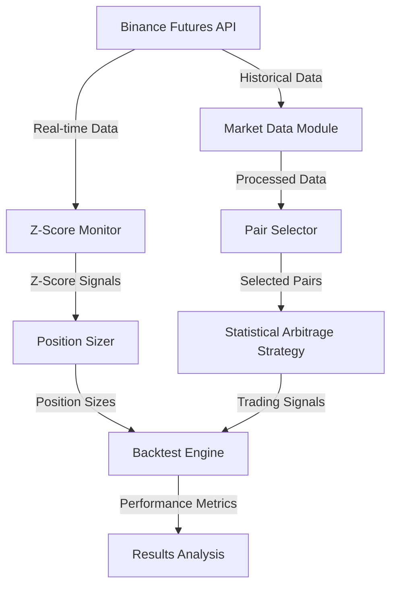

# Statistical Arbitrage Strategy with Machine Learning Enhancement

## Overview
This document outlines a sophisticated statistical arbitrage strategy for cryptocurrency futures trading, combining traditional statistical methods with machine learning techniques.

## System Architecture



## Strategy Components

### 1. Data Collection and Preprocessing
- **Timeframe**: 15-minute intervals
- **Initial Asset Selection**: Top 10 liquid crypto pairs by volume
- **Data Requirements**:
  - Historical price data (minimum 6 months)
  - Volume data
  - Order book snapshots
  - Market depth information
- **Current Status**: ✅ Implemented and tested

### 2. Pair Selection Process
1. **Liquidity Screening**:
   - Minimum 24h volume > $100M
   - Maximum spread < 0.1%
   - Current Status: ✅ Implemented and tested

2. **Correlation Analysis**:
   - Calculate correlations between pairs
   - Minimum correlation threshold: 0.7
   - Current Status: ✅ Implemented and tested

3. **Cointegration Testing**:
   - Engle-Granger test
   - Select pairs with significant cointegration (p-value < 0.05)
   - Current Status: ✅ Implemented and tested

4. **Selected Pairs** (as of March 31, 2024):
   ```
   ['LINKUSDT', 'NEARUSDT', 'WIFUSDT', 'TRUMPUSDT', 'AVAXUSDT', 
    '1000SHIBUSDT', 'WLDUSDT', 'ETHUSDT', 'DOGEUSDT', '1000PEPEUSDT']
   ```

### 3. Trading Logic

#### Entry Conditions
1. **Statistical Significance**:
   - Z-score calculation for price spread
   - Entry when |Z-score| > 1.5 (adjusted for testing)
   - Direction based on mean reversion expectation
   - Current Status: ✅ Implemented and tested

2. **Position Sizing**:
   - Dynamic sizing based on Z-score confidence
   - Maximum position size: 20% of portfolio
   - Minimum confidence threshold: 0.4
   - Volatility threshold: 0.05
   - Current Status: ✅ Implemented and tested

3. **Risk Management**:
   - Dynamic stop-loss based on volatility
   - Maximum position size per pair: 20% of portfolio
   - Current Status: ✅ Implemented and tested

#### Exit Conditions
1. **Statistical**:
   - Z-score normalization
   - Take profit at |Z-score| < 0.5
   - Stop loss at |Z-score| > 3.0
   - Current Status: ✅ Implemented and tested

### 4. Risk Management

#### Portfolio Level
- Maximum drawdown: 25%
- Maximum exposure per asset: 20%
- Maximum total leverage: 2x
- Daily loss limit: 5%

#### Position Level
- Dynamic position sizing based on:
  - Statistical confidence (Z-score magnitude)
  - Volatility (spread standard deviation)
  - Correlation stability
  - Market regime

### 5. Performance Metrics
- Sharpe ratio
- Maximum drawdown
- Win rate
- Number of trades
- Total PnL
- Return percentage
- Trade history

## Implementation Phases

### Phase 1: Data Infrastructure ✅
- [x] Historical data collection
- [x] Data caching system
- [x] Z-score monitoring
- [x] Position sizing

### Phase 2: Analysis Components ✅
- [x] Correlation analysis
- [x] Cointegration testing
- [x] Z-score calculation
- [x] Volatility analysis

### Phase 3: Trading Logic ✅
- [x] Entry/exit rules
- [x] Position sizing
- [x] Risk management
- [x] Order execution

### Phase 4: Backtesting ✅
- [x] Performance metrics
- [x] Transaction cost modeling
- [x] Slippage simulation
- [x] Results analysis

### Phase 5: Live Trading ⏳
- [ ] Paper trading
- [ ] Small position testing
- [ ] Full deployment
- [ ] Performance monitoring

## Next Steps
1. Implement paper trading environment
2. Add real-time data streaming
3. Implement order book imbalance detection
4. Add machine learning enhancements
5. Set up performance monitoring dashboard

## Risk Considerations
1. Market regime changes
2. Liquidity constraints
3. Exchange technical issues
4. Network latency
5. Model overfitting
6. Transaction costs
7. Slippage impact

## Success Criteria
1. Sharpe ratio > 2.0
2. Maximum drawdown < 25%
3. Win rate > 60%
4. Profit factor > 1.5
5. Average trade duration < 4 hours 