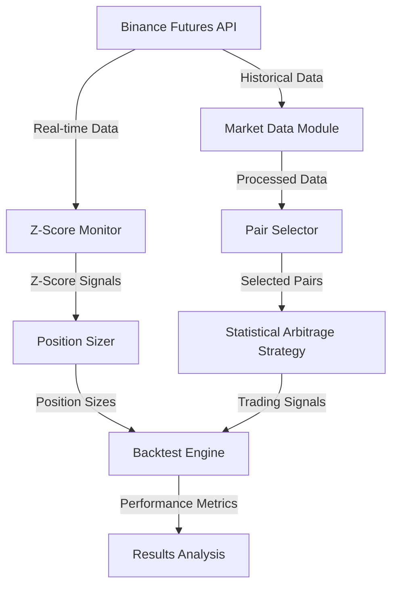

# Statistical Arbitrage Strategy with Machine Learning Enhancement

## Overview
This document outlines a sophisticated statistical arbitrage strategy for cryptocurrency futures trading, combining traditional statistical methods with machine learning techniques. The current focus is on optimizing the strategy for 4-hour timeframe and improving profitability after commissions through rigorous backtesting.

## System Architecture



## Strategy Components

### 1. Data Collection and Preprocessing
- **Timeframe**: 4-hour intervals (changed from 1-hour intervals)
- **Initial Asset Selection**: Top 10 liquid crypto pairs by volume
- **Data Requirements**:
  - Historical price data (minimum 6 months)
  - Volume data
  - Order book snapshots
  - Market depth information
- **Current Status**: ✅ Implemented and tested

### Timeframe Change (20240408)
- Changed from 1-hour to 4-hour timeframe to:
  - Significantly reduce trading frequency
  - Lower commission costs
  - Improve signal quality
  - Reduce noise in price movements
  - Better align with market cycles
  - Allow for more meaningful spread movements
- Expected impact:
  - Fewer trades per day
  - Lower commission costs
  - More stable signals
  - Longer trade durations
  - Better risk management
  - Higher profit per trade

### 2. Pair Selection Process
1. **Liquidity Screening**:
   - Minimum 24h volume > $200M (increased from $100M)
   - Maximum spread < 0.1%
   - Current Status: ✅ Implemented and tested

2. **Correlation Analysis**:
   - Calculate correlations between pairs
   - Minimum correlation threshold: 0.8 (increased from 0.7)
   - Current Status: ✅ Implemented and tested

3. **Cointegration Testing**:
   - Engle-Granger test
   - Select pairs with significant cointegration (p-value < 0.05)
   - Current Status: ✅ Implemented and tested

4. **Selected Pairs** (as of April 8, 2024):
   ```
   ['LINKUSDT', 'NEARUSDT', 'WIFUSDT', 'AVAXUSDT', 
    '1000SHIBUSDT', 'WLDUSDT', 'ETHUSDT', 'DOGEUSDT', '1000PEPEUSDT']
   ```

### 3. Trading Logic

#### Entry Conditions
1. **Statistical Significance**:
   - Z-score calculation for price spread
   - Entry when |Z-score| > 2.5 (adjusted for 4h timeframe)
   - Direction based on mean reversion expectation
   - Current Status: ✅ Implemented and tested

2. **Position Sizing**:
   - Dynamic sizing based on Z-score confidence
   - Maximum position size: 10% of portfolio
   - Minimum confidence threshold: 0.4
   - Volatility threshold: 0.015 (reduced from 0.02)
   - Current Status: ✅ Implemented and tested

3. **Risk Management**:
   - Dynamic stop-loss based on volatility
   - Maximum position size per pair: 10% of portfolio
   - Maximum trade duration: 24 hours
   - Current Status: ✅ Implemented and tested

#### Exit Conditions
1. **Statistical**:
   - Z-score normalization
   - Take profit at |Z-score| < 0.8 (adjusted for 4h timeframe)
   - Stop loss at |Z-score| > 3.0
   - Current Status: ✅ Implemented and tested

### 4. Risk Management

#### Portfolio Level
- Maximum drawdown: 25%
- Maximum exposure per asset: 10%
- Maximum total leverage: 2x
- Daily loss limit: 5%

#### Position Level
- Dynamic position sizing based on:
  - Statistical confidence (Z-score magnitude)
  - Volatility (spread standard deviation)
  - Correlation stability
  - Market regime
  - Time of day

### 5. Performance Metrics
- Sharpe ratio
- Maximum drawdown
- Win rate
- Number of trades
- Total PnL
- Return percentage
- Trade history
- Commission impact
- Slippage analysis
- Trade duration distribution

## Implementation Phases

### Phase 1: Data Infrastructure ✅
- [x] Historical data collection
- [x] Data caching system
- [x] Z-score monitoring
- [x] Position sizing

### Phase 2: Analysis Components ✅
- [x] Correlation analysis
- [x] Cointegration testing
- [x] Z-score calculation
- [x] Volatility analysis

### Phase 3: Trading Logic ✅
- [x] Entry/exit rules
- [x] Position sizing
- [x] Risk management
- [x] Order execution

### Phase 4: Backtesting ⏳
- [x] Performance metrics
- [x] Transaction cost modeling
- [x] Slippage simulation
- [x] Results analysis
- [ ] Strategy optimization
- [ ] Parameter tuning
- [ ] Commission optimization

### Phase 5: Live Trading
- [ ] Paper trading
- [ ] Small position testing
- [ ] Full deployment
- [ ] Performance monitoring

## Current Focus Areas

### 1. Strategy Optimization
- Fine-tune entry/exit thresholds for 4h timeframe
- Optimize position sizing for better risk-adjusted returns
- Implement dynamic stop-loss based on spread volatility
- Add market regime detection for adaptive parameters

### 2. Commission Optimization
- Reduce trading frequency through:
  - Higher entry thresholds
  - Minimum time between trades
  - Trade clustering
  - Volume-based commission discounts

### 3. Performance Analysis
- Detailed commission impact analysis
- Slippage modeling and optimization
- Trade duration analysis
- Win rate by time of day
- Market regime performance

### 4. Risk Management Enhancement
- Implement trailing stops
- Add maximum trade duration
- Dynamic position sizing based on:
  - Market conditions
  - Time of day
  - Volatility regime
  - Spread characteristics

## Success Criteria
1. Sharpe ratio > 2.0
2. Maximum drawdown < 25%
3. Win rate > 60%
4. Profit factor > 1.5
5. Average trade duration < 24 hours
6. Commission impact < 30% of gross profit
7. Average profit per trade > 2x commission cost

## Quick Testing

The strategy supports quick testing through the `test_duration_hours` parameter, which allows you to run shorter backtests for development and debugging purposes.

### Configuration

```python
config = {
    'strategy_version': 'v2',
    'symbols': ['BTCUSDT', 'ETHUSDT'],
    'timeframe': '4h',
    'test_duration_hours': 4  # Quick test with 4 hours of data
}
```

### Implementation Details

The quick testing feature works by:

1. **Data Limitation**
   - Only loads the most recent N hours of data
   - Maintains data consistency across all symbols
   - Preserves the train/test/val split proportionally

2. **Performance Impact**
   - Significantly reduces backtest runtime
   - Lowers memory requirements
   - Enables faster iteration during development

3. **Use Cases**
   - Strategy development and debugging
   - Parameter optimization
   - Capital change validation
   - Quick performance checks

### Best Practices

1. **Development Workflow**
   - Use quick tests (4-8 hours) during development
   - Run full backtests before major changes
   - Validate results with different time periods

2. **Parameter Testing**
   - Test parameter changes with quick tests first
   - Verify capital changes and position sizing
   - Check signal generation and execution

3. **Production Considerations**
   - Always run full backtests before deployment
   - Consider market conditions in test period
   - Validate results across different timeframes

### Example Usage

```python
# Quick test configuration
config = {
    'test_duration_hours': 4,
    'initial_capital': 10000.0,
    'max_position_size': 0.1,
    'stop_loss': 0.02,
    'take_profit': 0.03
}

# Run backtest
results = backtest_strategy(data, **config)
```

### Limitations

1. **Representativeness**
   - Short test periods may not capture all market conditions
   - Results may not reflect long-term performance
   - Limited sample size for statistical significance

2. **Data Requirements**
   - Need sufficient historical data for accurate testing
   - Market conditions may vary significantly
   - Commission impact may be underestimated 